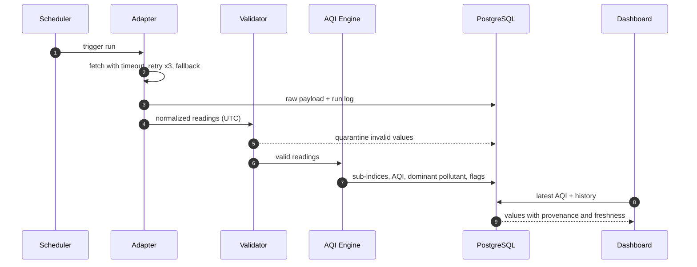
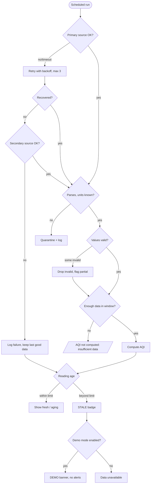
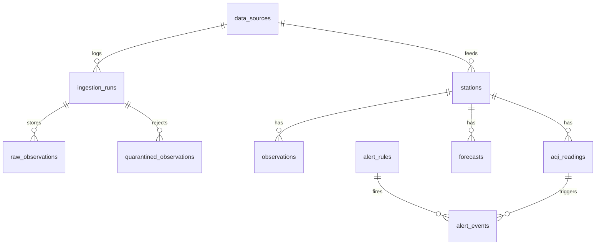

<div align="center">


[](https://mohithofficiall-commits.github.io/airpulse-ai/)

[](https://mohithofficiall-commits.github.io/airpulse-ai/)
[](https://github.com/Mohithofficiall-commits/airpulse-ai)


**[Live App](https://mohithofficiall-commits.github.io/airpulse-ai/)** · **[Source Code](https://github.com/Mohithofficiall-commits/airpulse-ai)** · **[Architecture](#-architecture)** · **[Roadmap](#-roadmap)**

</div>

---

## ✨ What is AirPulse AI?

AirPulse AI is a hackathon prototype that collects urban air-quality readings, validates them, computes an AQI using the **India / CPCB methodology**, and shows current conditions and alerts on a web dashboard. It focuses on **transparency**: every reading carries its source, timestamp, freshness and quality flags, and demo data is always labeled.

Most AQI displays give one number. AirPulse tries to answer:

| Question | AirPulse design response |
| :-- | :-- |
| Which pollutant drives the AQI? | Sub-indices + dominant pollutant |
| How old is this reading? | `fresh` / `aging` / `stale` badge |
| Was the value checked? | Validation layer + quality flags + quarantine |
| What if the source fails? | Fallback source → last good data → STALE → labeled DEMO |
| How good is the forecast? | Baseline models with MAE / RMSE and sample size |

> **Honesty note.** Feature status below reflects the design blueprint. Items must be confirmed against the repository before submission. Nothing here is a measured result.

---

## 🏗 Architecture

<div align="center">

</div>

<sub>Animated flow: blue dashes = valid data path, red = quarantined data, amber = operator-enabled demo path.</sub>

### Data flow



### Failure handling



---

## 🧮 AQI methodology (CPCB, India default)

- Sub-index per pollutant → **overall AQI = max sub-index**; that pollutant is the **dominant pollutant**.
- Requires **≥ 3 pollutants, at least one PM2.5 or PM10**; otherwise "insufficient data".
- Averaging: PM2.5/PM10/NO₂/SO₂/NH₃ 24 h · O₃ 8 h · CO 8 h; about **16 h minimum** of data per window.
- Piecewise-linear formula: `Ip = ((I_hi − I_lo) / (BP_hi − BP_lo)) × (Cp − BP_lo) + I_lo`
- Breakpoints live in **data (JSON), not code**, and each AQI record stores `methodology` + `methodology_version`.
- Values above the top band cap at 500 with an `above_scale` flag.

**Illustrative test vector** (to be locked by tests): PM2.5 = 75 µg/m³ → ≈ 148.8 → **149**.

> Verify breakpoints against the current CPCB publication before submission.

---

## 🗄 Data model (proposed)



**Security:** RLS on all tables · anon = read-only on public data · writes via service role from Edge Functions only · secrets never in client code or repo.

---

## 🔔 Alerts and 📈 Forecast

- **Alerts:** category crossing, dominant-pollutant change, stale data for a subscribed station. Cool-down + hysteresis; **demo data never triggers real notifications**.
- **Forecast:** persistence, seasonal naive, moving average/EWMA. Walk-forward evaluation, **MAE / RMSE with n** shown. Under minimum history the UI says *"Forecast unavailable"* and never invents a value.

---

## 🧰 Tech stack

| Layer | Technology |
| :-- | :-- |
| Frontend | React, hosted on GitHub Pages |
| Backend | Supabase (PostgreSQL, Auth, RLS, Realtime, Edge Functions) |
| Ingestion | Scheduled adapters (sources to be verified for access, licensing, limits) |
| Testing | AQI vectors, validation, fault-injection, RLS checks |

---

## 🗺 Roadmap

| Phase | Focus | Status |
| :-- | :-- | :-- |
| 0 | Foundation: repo, Supabase, secrets, migrations | ☐ confirm |
| 1 | Core MVP: adapter → validation → CPCB engine → dashboard | ☐ confirm |
| 2 | Resilience: retry, quarantine, STALE, labeled demo fallback | ☐ confirm |
| 3 | History charts and alerts | ☐ confirm |
| 4 | Baseline forecast + MAE/RMSE | ☐ confirm |
| 5 | Hardening: second source, RLS audit, benchmarks, more regions | 📋 planned |

---

## 🚀 Run locally

```bash
git clone https://github.com/Mohithofficiall-commits/airpulse-ai.git
cd airpulse-ai
npm install
cp .env.example .env   # add your Supabase URL and ANON key only
npm run dev
```

> Never commit the service-role key or third-party API keys.

---

## ⚠️ Limitations

Informational only, not medical advice · does not reduce emissions · baseline forecasts ignore weather, traffic, festivals and fires · station coverage limited to the prototype · all metrics are targets until measured.

---

<div align="center">

**[Open the live app →](https://mohithofficiall-commits.github.io/airpulse-ai/)**

Built for a hackathon · transparency over hype

</div>
